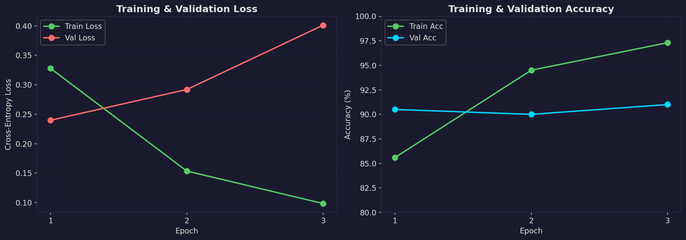
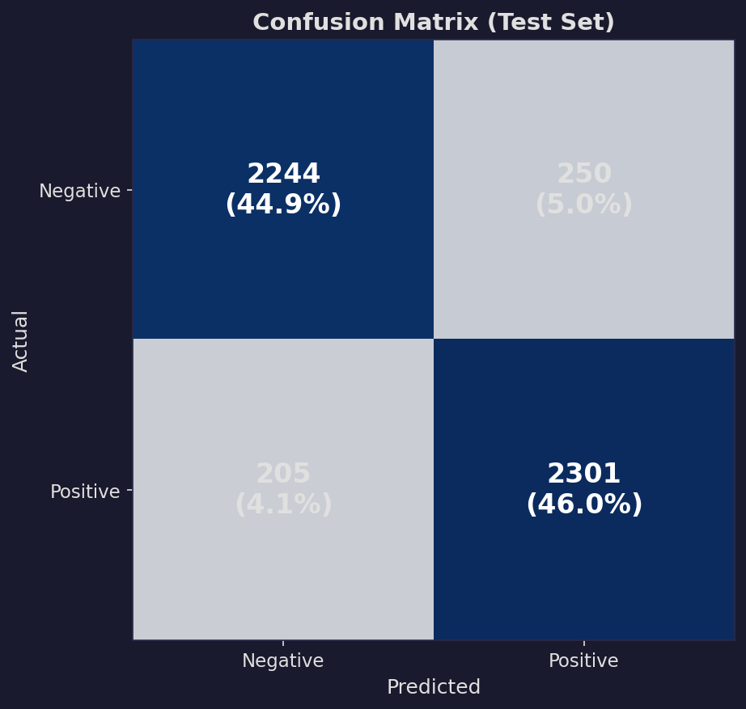
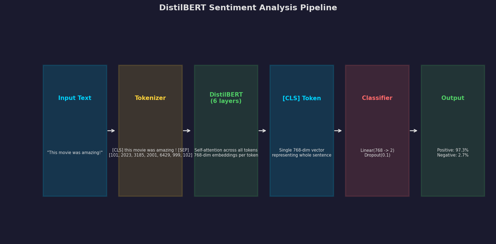

# Sentiment Analyzer

A sentiment analysis model fine-tuned on IMDb movie reviews using DistilBERT. Classifies text as positive or negative with confidence scores. Includes a Gradio web UI for interactive analysis.

## Results

### Training Performance


The model converges extremely fast thanks to pre-training — **90.5% validation accuracy after just 1 epoch** (37 seconds on RTX 4090). By epoch 3, train accuracy reaches 97.3% while validation holds at 91%.

| Metric | Value |
|--------|-------|
| Test Accuracy | **90.9%** |
| F1 Score | 0.91 |
| Training Time | ~108 seconds (3 epochs) |
| Parameters | 66.4M |
| GPU | RTX 4090 (FP16) |

### Confusion Matrix


Out of 5,000 test reviews:
- **2,244** negatives correctly identified, 250 false positives
- **2,301** positives correctly identified, 205 false negatives
- The model is slightly better at detecting positive sentiment

### Architecture


## How It Works

```
Input Text: "This movie was absolutely fantastic!"
     |
[Tokenizer] --> Split into subword tokens --> Convert to IDs
     |
[DistilBERT] --> Self-attention across all tokens --> Contextual embeddings
     |
[CLS Token] --> Single vector representing the whole sentence
     |
[Classifier] --> Linear layer --> Positive: 97.3% | Negative: 2.7%
```

**What is fine-tuning?** Instead of training from scratch, we start with DistilBERT which already "understands" language (trained on billions of words). We add a small classification layer and train the whole thing on our sentiment data. It's like hiring an English expert and teaching them to be a movie critic — much easier than starting from zero.

## Features

- **Fine-tuned DistilBERT** — Pre-trained on billions of words, specialized for sentiment
- **IMDb Dataset** — Trained on 25,000 movie reviews (positive/negative)
- **GPU Accelerated** — Mixed precision (FP16) training on NVIDIA GPUs
- **Web UI** — Gradio interface for single and batch analysis
- **Batch Mode** — Analyze multiple texts at once

## Setup

```bash
git clone git@github.com:H4ph4z4rdz/sentiment-analyzer.git
cd sentiment-analyzer

python -m venv venv
venv\Scripts\activate          # Windows
# source venv/bin/activate     # Linux/Mac

pip install -r requirements.txt
```

## Usage

### 1. Train the Model

```bash
python src/train.py
```

### 2. Launch the Web UI

```bash
python src/app.py
```

Open **http://localhost:7862** in your browser.

## Project Structure

```
sentiment-analyzer/
├── assets/                    # Charts for README
├── configs/
│   └── default.yaml           # All configuration
├── models/                    # Saved model weights (auto-generated)
└── src/
    ├── train.py               # Training script
    ├── app.py                 # Gradio web UI
    ├── generate_charts.py     # Chart generation for README
    └── core/
        ├── data.py            # Dataset loading & tokenization
        ├── model.py           # DistilBERT + classification head
        ├── trainer.py         # Fine-tuning training loop
        └── evaluate.py        # Test metrics & evaluation
```

## Configuration

Edit `configs/default.yaml`:

| Parameter | Default | Description |
|-----------|---------|-------------|
| `model.name` | distilbert-base-uncased | Pre-trained transformer |
| `model.max_length` | 256 | Max input tokens |
| `training.epochs` | 3 | Fine-tuning epochs |
| `training.batch_size` | 16 | Batch size |
| `training.learning_rate` | 2e-5 | Learning rate |
| `training.fp16` | true | Mixed precision training |

## Tech Stack

- **PyTorch** — Deep learning framework
- **Hugging Face Transformers** — Pre-trained models
- **Hugging Face Datasets** — Dataset loading
- **scikit-learn** — Evaluation metrics
- **Gradio** — Web UI

## License

MIT
